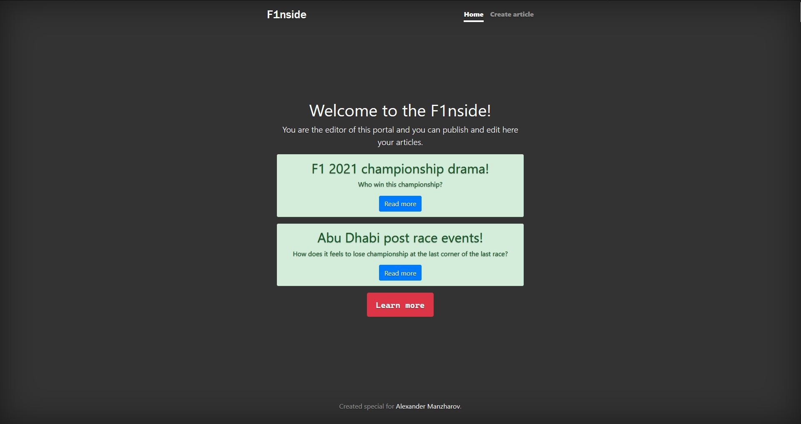
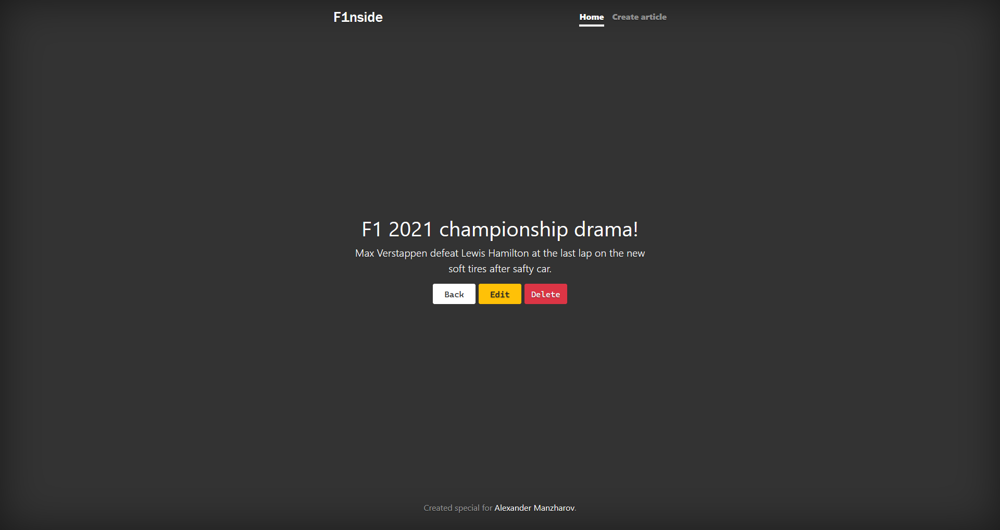
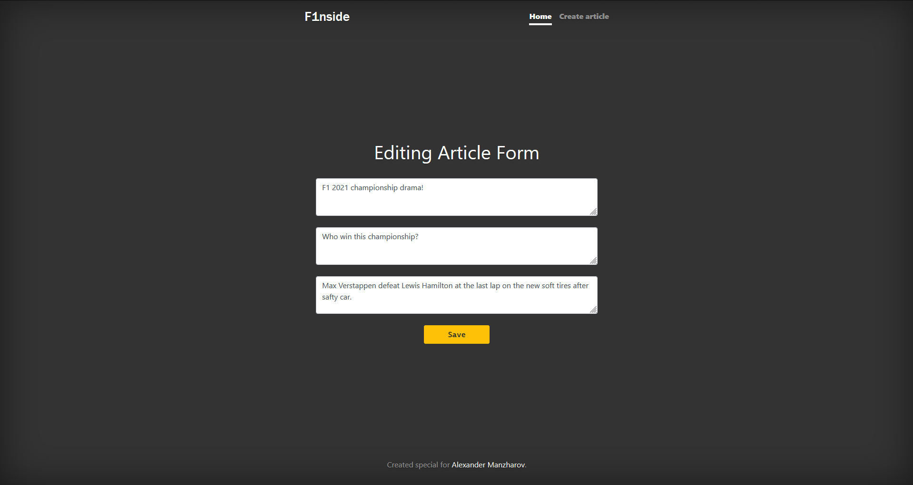
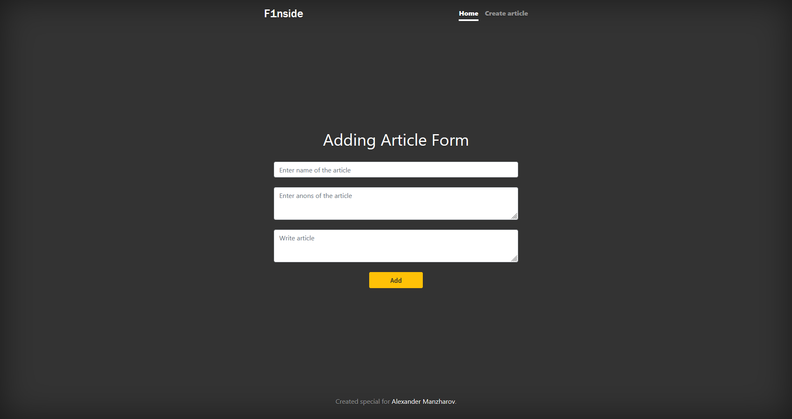

# **F1nside** - post and edit articles about f1 live

> **What to do?**
1. Clone project
```bash
  git clone https://github.com/KJis1809/F1nside
```
2. Create database and table on your mysql server
```mysql
  CREATE DATABASE f1nside;

  CREATE TABLE articles (
    id INT(11) NOT NULL AUTO_INCREMENT,
    title VARCHAR(100) NOT NULL,
    anons VARCHAR(255) NOT NULL,
    article_text TEXT NOT NULL,
    PRIMARY KEY (id)
);
```
3. Set connection parameters for your database in main.go
   You can find this settings in function connectToDb() ;)

4. Open your nginx.conf and add this inside http -> server -> location / brackets
```
  proxy_pass http://localhost:8080;
```
5. Run application and go to your browser to localhost


# **Demo pages**

## Main page



## Full article view



## Editing article form



## Create article form


